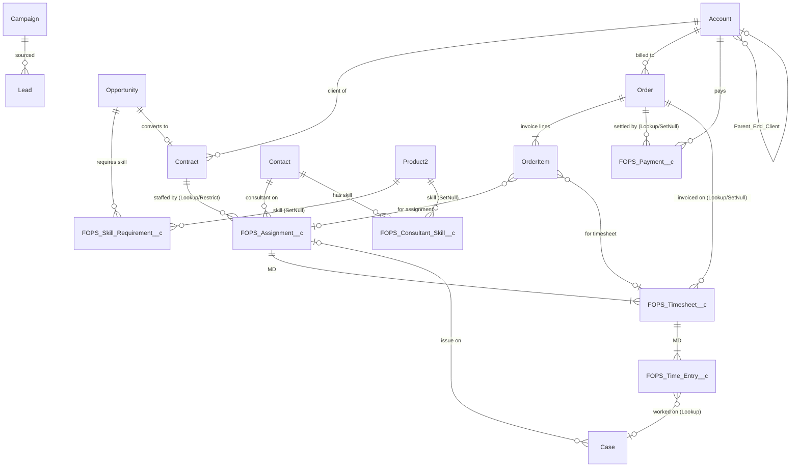

# FreelanceHub — Salesforce Architecture & Data-Model Design

**Component:** `myreactapp` UI Bundle (LWR-hosted React) reading/writing via Salesforce **GraphQL (uiapi)**, backed by the **FreelanceOps** data model.
**Audience:** Solution Architect + Fullstack Developer (parallel tracks).
**Scope:** Salesforce-side architecture, data model, and the **GraphQL data contract** between platform and frontend. No application code.
**Status:** Design v1.0 — 2026-08-10.

> **Reading contract for the Fullstack Developer:** you own React-internal architecture (folders, state, bundling). This document owns the *shape of the data*, the *query/mutation contracts*, and the *performance/security envelope* those contracts must respect. Where a section says **CONTRACT**, treat it as a fixed interface; changes require an architecture review.

---

## 0. TL;DR for engineers

- The financial spine — **Assignment → Timesheet → Time Entry** — is correctly modeled as **master-detail (MD)** for the two lower links and **Lookup+Restrict** above. Keep it. Native roll-up summaries do the heavy lifting where MD exists; **Apex/Flow roll-ups** cover the Lookup boundaries (Contract, Account, Order).
- **Read via one aliased GraphQL query per screen.** GraphQL uiapi now supports **`aggregate` + `groupBy`** (sum/avg/count/min/max/countDistinct), so dashboard KPIs are computed **server-side in a single round-trip** — no N+1, no client fan-out.
- **Write via uiapi mutations for the simple 90%**, and **Apex `@AuraEnabled` services (WITH USER_MODE) for the invariant-critical 10%**: gapless invoice numbering, frozen-rate capture, rate normalization, cross-object financial posting.
- **Confidential bill-rate/margin** is enforced by **FLS at the field level** (already configured on `FOPS_Consultant`), which propagates automatically through uiapi and through `WITH USER_MODE` Apex. The app must **never** reconstruct margin client-side from cost + bill.

---

## 1. Data Model Review

### 1.1 ER diagram (as-built, FreelanceOps)



**Legend:** `||--|{` = master-detail (cascade delete, native roll-ups). `||--o{` / `}o--o|` = lookup. Delete constraints noted where they matter.

### 1.2 Master-Detail vs Lookup — verdict

| Relationship | As-built | Verdict | Rationale |
|---|---|---|---|
| Time Entry → Timesheet | **MD** | ✅ Correct | Entries are meaningless without their sheet; want cascade delete + native SUM roll-ups (hours, billable hours). |
| Timesheet → Assignment | **MD** | ✅ Correct | Weekly sheets belong to the assignment; enables roll-ups of hours/amount to Assignment. |
| Assignment → Contract | **Lookup + Restrict, required** | ✅ Correct (deliberate) | MD here would cascade-delete assignments (and their financial timesheets/entries) if a Contract were deleted — unacceptable for financial records. **Restrict** blocks the delete instead. Cost: no *native* roll-up Contract⇐Assignment → use Apex/Flow (see 1.3). |
| Assignment → Contact (consultant) | **Lookup + Restrict** | ✅ Correct | A consultant participates in many assignments; must not cascade. |
| Payment → Order / Account | **Lookup + SetNull** | ✅ Correct | Payments survive order edits; independent financial ledger. Consider **Restrict** on Payment→Account if lifetime-billed integrity is critical (see risks). |
| Timesheet → Order | **Lookup + SetNull** | ✅ Correct | Invoicing link; a sheet can be re-billed/credited. Keep loose. |
| OrderItem → Assignment / Timesheet | **Lookup** | ✅ Correct | Invoice lines reference source records without owning them. |
| Skill Requirement (Opp↔Product2) | **Lookup×2** (Opp Restrict, Product2 SetNull) | ⚠️ Acceptable | True junction semantics would be **MD-MD**, but Product2 (a standard object with its own lifecycle) is a poor MD master, and MD-MD would force ownership/sharing to derive from parents. Lookup junction is the pragmatic call. Trade-off: **no native roll-up** of match counts — compute match score in Apex/GraphQL aggregate. |
| Consultant Skill (Contact↔Product2) | **Lookup×2** | ⚠️ Acceptable | Same reasoning. |
| Time Entry → Case | **Lookup** | ✅ Correct | Optional attribution; never owns the Case. |

**Design principle to hold the line on:** the **money spine is MD** (fast, governor-free roll-ups; atomic cascade within a timesheet/assignment), and every **cross-entity financial boundary is Lookup+Restrict** (no accidental cascade deletes of ledgers). This is the right shape — do not "upgrade" the Contract or Account links to MD.

### 1.3 Roll-up strategy — native vs Apex vs live GraphQL aggregate

Three tiers, chosen by *where the relationship is MD* and *how fresh the number must be*:

**Tier A — Native roll-up summary (already MD; keep/add these).** Zero Apex, maintained transactionally by the platform, indexed for reads.

| Parent | Field | Op | Source | Status |
|---|---|---|---|---|
| Timesheet | `FOPS_Total_Hours__c` | SUM | TimeEntry.Hours | ✅ exists |
| Timesheet | `FOPS_Billable_Hours__c` | SUM | TimeEntry.Hours (billable filter) | ✅ exists |
| Assignment | **`FOPS_Total_Billable_Hours__c`** | SUM | Timesheet.Billable_Hours | ➕ add |
| Assignment | **`FOPS_Timesheet_Count__c`** | COUNT | Timesheet | ➕ add |
| Assignment | **`FOPS_Approved_Billable_Amount_Base__c`** | SUM | Timesheet.Billable_Amount_Base (approved) | ➕ add (base currency only — see note) |

> **Multi-currency roll-up caution:** native roll-ups **only sum a currency field in its own currency**; you cannot SUM mixed-currency child amounts safely. Because FreelanceOps already stores a **`*_Base__c` (frozen)** amount on every financial record, **roll up the `_Base__c` fields only** — they are a single common currency by construction. Never roll up the transactional-currency amount across children.

**Tier B — Apex/Flow-maintained stored field (Lookup boundary, or a computed product roll-ups can't do).** Roll-up summaries can't cross Lookup and can't do `rate × hours`. Maintain these with a **bulkified, `WITH USER_MODE`-aware Apex trigger handler** (or Record-Triggered Flow for low volume), guarded by a recalculation service so backfills are safe.

| Parent | Field | Why not native |
|---|---|---|
| Timesheet | `FOPS_Billable_Amount__c` / `_Base__c`, `FOPS_Cost_Amount__c` | Product of hours × frozen rate × multiplier — roll-up can't compute; Apex on TimeEntry change. |
| Contract | `FOPS_Contract_Value_Base__c` | Assignment→Contract is **Lookup**. Apex SUM of Assignment base values. |
| Account | `FOPS_Lifetime_Billed_Base__c` | Order→Account is standard Lookup (no roll-up). Apex SUM of sent/paid Order base totals. |
| Account | `FOPS_Average_DSO_Days__c` | Derived metric across Orders/Payments; Apex or scheduled batch. |
| Contact | `FOPS_Utilisation_Current_Month__c` | Cross-object time-window aggregate; **nightly batch** (not real-time). |

**Tier C — Live GraphQL `aggregate` (compute at read time, never stored).** Use for **dashboard KPIs and ad-hoc slices** where staleness is unacceptable and the group set is small. GraphQL uiapi supports `aggregate { … sum/avg/count/min/max/countDistinct }` with `groupBy`. This removes the need to invent a stored roll-up for every dashboard tile.

- "Hours logged this week across my assignments" → live aggregate over Time Entry.
- "Pipeline value by pursuit stage" → live aggregate over Opportunity grouped by `FOPS_Pursuit_Status__c`.
- "Unbilled approved timesheets $" → live aggregate over Timesheet where status = Approved and Order is null.

**Decision rule:** *MD + always-needed on the record page* → **Tier A**. *Lookup boundary or a formula-of-products, still needed on the record* → **Tier B**. *Dashboard/analytics, must be live, many possible slices* → **Tier C**. When Tier A/B and Tier C both work, prefer **Tier A/B for record-detail reads** (indexed, one field fetch) and **Tier C for dashboards** (one aggregate call, no field sprawl).

### 1.4 Indexing & External Id recommendations

The GraphQL layer sits on SOQL; **every filter/sort the app relies on must land on a selective, indexed field** or it will table-scan at LDV. Salesforce auto-indexes: PK (Id), Name, foreign keys (all MD/Lookup), `CreatedDate`/`SystemModstamp`, audit fields, and any field marked **`unique`** or **`externalId`**.

**Already indexed for free (verified in metadata):**
- All relationship fields: `FOPS_Time_Entry__c.FOPS_Timesheet__c`, `FOPS_Timesheet__c.FOPS_Assignment__c`, `FOPS_Assignment__c.FOPS_Contract__c/FOPS_Consultant__c`, `FOPS_Payment__c.FOPS_Order__c/FOPS_Account__c`, etc.
- `Order.FOPS_Invoice_Number__c` — **`unique` + `externalId`** ✅ (gapless human key; also the natural upsert key for external accounting sync).

**Add custom indexes (deploy via `<CustomField>`+`SforceService` request / Salesforce Support) on the fields the app filters or sorts on:**

| Object | Field | Used by | Note |
|---|---|---|---|
| FOPS_Time_Entry__c | `FOPS_Work_Date__c` | Timesheet grid, "hours this week", date-range reports | Highest-volume object; date-range filters must be selective. |
| FOPS_Time_Entry__c | `FOPS_Is_Billable__c` | billable roll-ups, billing screen | Low-selectivity boolean alone — index only pays off **compounded** with Work_Date (see two-column index). |
| FOPS_Timesheet__c | `FOPS_Status__c` | approval queue, "unbilled approved" | Combine with Period_End for the queue view. |
| FOPS_Timesheet__c | `FOPS_Period_End__c` | period lists, billing runs | |
| FOPS_Payment__c | `FOPS_Status__c`, `FOPS_Payment_Date__c` | cash dashboard, aging | |
| Order | `FOPS_Invoice_Status__c`, `FOPS_Due_Date__c` | AR aging, overdue list | `Days_Overdue`/`Balance_Due` are formulas — **not indexable**; filter on the stored `Due_Date`/`Invoice_Status` instead. |
| Opportunity | `FOPS_Pursuit_Status__c`, `FOPS_Stage_Entered_Date__c` | pipeline board, "days in stage" | 11 custom stages → good selectivity. |

**Two-column (compound) custom indexes** for the hot list queries (Salesforce supports these on request and they beat two single-column indexes for AND-filters):
- `FOPS_Time_Entry__c (FOPS_Timesheet__c, FOPS_Work_Date__c)` — grid load.
- `FOPS_Timesheet__c (FOPS_Status__c, FOPS_Period_End__c)` — approval queue.
- `Order (FOPS_Invoice_Status__c, FOPS_Due_Date__c)` — AR aging.

**External Id recommendations (integration + upsert keys):**
- `Order.FOPS_Invoice_Number__c` — already externalId; keep. Primary sync key to the accounting system.
- Add **`externalId` on `FOPS_Payment__c.FOPS_Reference__c`** — bank/remittance reference; enables idempotent payment upsert from bank feeds without duplicates.
- Consider **`externalId` on `FOPS_Assignment__c`** via a new `FOPS_External_Key__c` (e.g., ATS/HR system id) if assignments are provisioned upstream.
- Do **not** mark low-cardinality picklists as externalId — externalId implies an index that helps only selective lookups.

**Selectivity rules the query contract must obey** (query optimizer): a filter is selective when it matches **≤30% of the first 1M rows and ≤15% beyond**. Avoid the anti-patterns that void indexes: `!=`, `NOT`, `NOT IN`, leading-wildcard `LIKE '%x'`, comparisons on **formula fields** (`Balance_Due`, `Days_Overdue`, `Gross_Margin_Percent`), and `OR` across different objects' fields. Filter on stored, indexed columns; do date math on stored `Date`/`DateTime` fields.

---

## 2. Read Architecture (GraphQL / uiapi)

### 2.1 Principles (the read contract)

1. **One screen → one GraphQL query.** GraphQL fetches multiple objects, nested and aliased, in a single request — more performant than multiple Apex wire calls. No screen should issue a fan-out of per-row queries (N+1).
2. **Field-selection discipline.** Request only the fields the screen renders. Large queries (many/big fields > ~32 KB) degrade performance, especially on mobile. No `SELECT *` mindset — enumerate fields.
3. **Cursor pagination, always.** Use `first` + `after`; read `pageInfo { hasNextPage endCursor }`. **Never request `totalCount`** on list views — it forces the optimizer to count *all* matching rows (full scan) even when you only render 20. Show "load more"/infinite scroll, not "page X of N", or compute counts separately/approximately.
4. **Bind filters as GraphQL variables**, not string interpolation — variables give the wire adapter reactive caching (refetch only when a variable changes) and keep queries parameterized/indexable.
5. **Page size ≤ 200 for interactive lists** (hard ceiling 2000/query). 20–50 is the sweet spot for first paint; prefetch the next page on idle.
6. **Read pre-computed numbers; don't recompute.** Roll-ups (Tier A/B) and formulas come back as plain fields — one fetch, already indexed. Only use `aggregate` (Tier C) for genuinely live/ad-hoc analytics.

### 2.2 Screen-by-screen query contracts

#### A) Dashboard KPIs — **one aliased multi-root query, one round-trip**

Combine independent aggregates and small lists under aliases so the whole dashboard hydrates in a single request:

```graphql
query FreelanceHubDashboard($meId: ID!, $weekStart: DateInput!, $today: DateInput!) {
  uiapi {
    # KPI 1: my hours this week (live aggregate)
    hoursThisWeek: aggregate(
      FOPS_Time_Entry__c: {
        where: { FOPS_Work_Date__c: { gte: $weekStart }
                 FOPS_Timesheet__c: { FOPS_Assignment__c: { FOPS_Consultant__c: { eq: $meId } } } }
      }
    ) { FOPS_Hours__c { sum { value } } }

    # KPI 2: pipeline by stage (live aggregate + groupBy)
    pipeline: aggregate(
      Opportunity: { where: { IsClosed: { eq: false } } }
      groupBy: { FOPS_Pursuit_Status__c }
    ) {
      groupings { FOPS_Pursuit_Status__c { value }
                  FOPS_Estimated_Total_Value_Base__c { sum { value } } }
    }

    # KPI 3: AR overdue (filter on stored Due_Date, not the Days_Overdue formula)
    overdue: aggregate(
      Order: { where: { FOPS_Invoice_Status__c: { eq: "Sent" }, FOPS_Due_Date__c: { lt: $today } } }
    ) { FOPS_Balance_Due__c { sum { value } } Id { count } }

    # Small list: timesheets awaiting my approval (record query, capped)
    approvals: FOPS_Timesheet__c(
      where: { FOPS_Status__c: { eq: "Submitted" } }
      orderBy: { FOPS_Period_End__c: { order: ASC } }
      first: 10
    ) {
      edges { node { Id FOPS_Period_End__c { value }
                     FOPS_Total_Hours__c { value }
                     FOPS_Assignment__r { FOPS_Consultant__r { Name { value } } } } }
      pageInfo { hasNextPage endCursor }
    }
  }
}
```

- **CONTRACT:** the dashboard consumes exactly these aliases. Adding a KPI = adding one aliased root, not a new network call.
- **Confidential note:** margin/bill-rate tiles are a *separate* fragment gated by persona (see §5) — the Consultant persona's query must not include them, because FLS will null them anyway and requesting them wastes payload.

#### B) List views (Timesheets, Invoices/Orders, Assignments, Pipeline)

```graphql
query TimesheetList($assignmentId: ID!, $after: String) {
  uiapi { query {
    FOPS_Timesheet__c(
      where: { FOPS_Assignment__c: { eq: $assignmentId } }
      orderBy: { FOPS_Period_End__c: { order: DESC } }
      first: 25
      after: $after
    ) {
      edges { node {
        Id
        FOPS_Period_Start__c { value }
        FOPS_Period_End__c { value }
        FOPS_Status__c { value }
        FOPS_Total_Hours__c { value }          # Tier A roll-up, pre-computed
        FOPS_Billable_Amount_Base__c { value } # Tier B, FLS-gated
      } }
      pageInfo { hasNextPage endCursor }
    }
  } }
}
```

- Sort/filter only on indexed fields (§1.4). `orderBy` on `Period_End` (indexed) — never on a formula.
- **No `totalCount`.** Infinite scroll with `endCursor`.
- **No N+1:** consultant name, assignment period etc. come through nested relationship fields in the *same* query, not per-row lookups.

#### C) Record detail (Timesheet with its Time Entries)

```graphql
query TimesheetDetail($id: ID!, $entriesAfter: String) {
  uiapi { query {
    FOPS_Timesheet__c(where: { Id: { eq: $id } }, first: 1) {
      edges { node {
        Id FOPS_Status__c { value } FOPS_Total_Hours__c { value }
        FOPS_Billable_Hours__c { value }
        FOPS_Assignment__r { Id FOPS_Consultant__r { Name { value } }
                             FOPS_Bill_Rate__c { value } }   # FLS nulls this for Consultant persona
        FOPS_Time_Entries__r(
          orderBy: { FOPS_Work_Date__c: { order: ASC } }
          first: 50 after: $entriesAfter
        ) {
          edges { node { Id FOPS_Work_Date__c { value } FOPS_Hours__c { value }
                         FOPS_Is_Billable__c { value } FOPS_Work_Category__c { value }
                         FOPS_Case__r { CaseNumber { value } } } }
          pageInfo { hasNextPage endCursor }
        }
      } }
    }
  } }
}
```

- Child entries paginate **inside** the parent (nested cursor) — a week is usually < 50 entries, so one page; longer periods "load more."

### 2.3 What to precompute vs query live (summary)

| Data | Strategy | Where |
|---|---|---|
| Timesheet hours/billable hours | **Precompute** (native roll-up) | Tier A field read |
| Timesheet billable/cost amount | **Precompute** (Apex, `rate×hours`) | Tier B field read |
| Assignment margin/margin % | **Precompute** (formula on stored base fields) | field read, FLS-gated |
| Contract value, Account lifetime billed | **Precompute** (Apex over Lookup) | Tier B field read |
| Dashboard KPIs, pipeline-by-stage, AR totals | **Query live** (GraphQL aggregate) | Tier C, one round-trip |
| Utilisation, DSO | **Precompute nightly** (batch) — too heavy for real-time | Tier B field read |

---

## 3. Write Architecture

### 3.1 Split: uiapi mutations vs Apex services

**Use uiapi `recordCreate/recordUpdate/recordDelete` (the simple, FLS-safe 90%)** for user-driven CRUD where the only invariants are field-level:
- Create/edit/delete **Time Entries** (hours, category, billable, case, note).
- Create a **Timesheet** shell; edit period/notes while `Draft`.
- Edit **Opportunity** stage fields, **Contact/Account** profile fields.
- These go straight through uiapi, which **enforces CRUD + FLS automatically** — a sub-contractor literally cannot write a field they can't see.

**Use Apex `@AuraEnabled` service methods (the invariant-critical 10%)** whenever an operation must be **atomic, ordered, or cross-object**, or must **read a confidential input to produce a non-confidential output**. Every such method runs **`WITH USER_MODE`** for queries/DML (enforces FLS+CRUD+sharing) and, where it must legitimately read a confidential field the *caller* can't (e.g., cost rate to compute an amount), is a **narrowly-scoped `WITH SYSTEM_MODE` block that returns only the non-confidential result** — never the raw confidential value.

| Operation | Why Apex | Key mechanics |
|---|---|---|
| **Gapless invoice numbering** | `OrderNumber` is not gapless; regulators/clients require sequential invoice numbers with no holes. | `SequenceService.next('INVOICE')`: `SELECT ... FROM FOPS_Sequence__c WHERE Name=:key **FOR UPDATE**` (pessimistic row lock) → increment → format → assign to `Order.FOPS_Invoice_Number__c`, all in **one transaction**. FOR UPDATE serializes concurrent invoice runs so two orders never grab the same number. Never allocate the number until commit is certain (allocate late, in the same DML). |
| **Frozen-rate capture** | The FX rate must be pinned at the business event, not recomputed. | On Timesheet approval / Order creation / Payment: read the effective `DatedConversionRate` for `FOPS_Exchange_Rate_Date__c`, write `FOPS_Exchange_Rate_Used__c` **and** the derived `*_Base__c` **stored** amount. Base amount is stored, never a formula — so historical records don't drift when rates change. |
| **Rate normalization** | Bill/cost rates come in per-hour/day/month/unit; roll-ups and margins need a common basis. | Normalize to `*_Monthly_Base__c` on Assignment create/update using `FOPS_*_Rate_Unit__c`; store the normalized value. Margin formula then operates on stored, comparable, base-currency numbers. |
| **Timesheet amount posting** | `billable_amount = Σ(hours × frozen_rate × multiplier)` across entries — not expressible as a roll-up. | Trigger/service on Time Entry insert/update/delete recomputes Timesheet `Billable_Amount(_Base)`/`Cost_Amount`; **bulkified** (one query, one update for all affected sheets). |
| **Invoice generation from timesheets** | Selects approved unbilled sheets → creates Order + OrderItems → stamps invoice #, frozen rate, links sheets → updates Account lifetime billed. | Single `SequenceService` call; all DML in **one transaction**; `Database.SaveResult` partial-failure handling; idempotency guard (don't double-bill a sheet already linked to an Order). |
| **Payment application & FX gain/loss** | Settlement rate differs from invoice rate → realized FX gain/loss must be computed and posted. | On Payment: compute `FOPS_FX_Gain_Loss_Base__c` from `Actual_Settlement_Rate` vs the order's frozen rate; update Order `Amount_Paid`; roll Account lifetime/ DSO. |

### 3.2 Transaction boundaries & bulkification

- **One logical business event = one Apex transaction.** Invoice generation (Order + N OrderItems + sheet links + sequence increment + Account roll) either all commits or all rolls back. Never split across client round-trips (a second call could fail leaving a half-invoice).
- **FOR UPDATE only inside the shortest possible critical section**, immediately before the dependent DML, to minimize lock hold time and avoid `UNABLE_TO_LOCK_ROW` under contention. Keep callouts *out* of the locked transaction (allocate number, commit, then any external sync via Platform Event / queueable).
- **Bulkify every trigger handler:** query once (map keyed by parent Id), compute in memory, one DML per object. The Time Entry → Timesheet amount recompute must handle a 200-row batch (data loader, bulk API) in constant query count.
- **Client batching:** if the app truly needs several independent writes at once (e.g., save a full week of entries), send them via a **single Apex service that does one bulk `insert`/`upsert`**, not 40 uiapi calls. For heterogeneous unrelated writes, the Composite (graph) API bounds them in one request/transaction.
- **Optimistic concurrency:** uiapi updates should send the record's last-known version; surface `409/CONFLICT` to the user rather than blind last-write-wins on financial records.

### 3.3 Write contract (for the frontend)

- **CONTRACT — Apex service surface (stable signatures):**
  - `InvoiceService.generateFromTimesheets(List<Id> timesheetIds) : InvoiceResult` (returns Order Id + invoice #).
  - `SequenceService.next(String sequenceKey) : String` (internal; not called directly by UI).
  - `PaymentService.apply(Id orderId, PaymentInput) : PaymentResult`.
  - `RateService.normalizeAssignment(Id assignmentId) : void` (also fired by trigger).
- **CONTRACT — uiapi is the path for:** Time Entry CRUD, Timesheet draft edits, profile edits. The frontend must **not** attempt to write `*_Base__c`, `Exchange_Rate_Used__c`, `Invoice_Number__c`, or any confidential field via uiapi — these are **system/Apex-owned**; make them read-only in FLS for interactive users so accidental writes are impossible.

---

## 4. Performance Budget

### 4.1 Targets (p75, warm org, broadband; ×1.5 budget on mobile/3G-fast)

| Interaction | Target | How it's met |
|---|---|---|
| **First contentful paint (bundle + shell)** | ≤ 1.5 s | LWR static bundle, code-split routes, app shell renders before data; skeletons while GraphQL resolves. |
| **Dashboard KPIs hydrated** | ≤ 1.2 s after shell | Single aliased aggregate query (§2.2A); server-side aggregation, no fan-out. |
| **List first page (25 rows)** | ≤ 800 ms | Indexed filter + sort, `first:25`, no `totalCount`, ≤ ~12 fields/row. |
| **Record detail (sheet + 50 entries)** | ≤ 1 s | Nested single query; roll-ups pre-computed (no client math). |
| **Save a week of time entries (bulk)** | ≤ 1.5 s | One Apex bulk upsert; optimistic UI updates immediately, reconciles on response. |
| **Invoice generation** | ≤ 2.5 s | One transaction; external sync deferred to async. |
| **GraphQL payload/screen** | < 32 KB | Field-selection discipline; the 32 KB line is where mobile perf degrades. |

### 4.2 Caching strategy (three layers)

1. **Server compute cache — Platform Cache (Org partition, ≥ 5 MB).** Cache **expensive, relatively static, shared** values: current `DatedConversionRate` set (per date), sequence *format* config, skill/product reference lists, persona→FLS resolution. Rules that must be honored: item ≤ 100 KB; **handle cache miss (null) → recompute + repopulate**; operate on **lists of keys** not singletons; don't cache **volatile** data (live balances, in-flight sequence values — those need FOR UPDATE, never cache). LRU evicts on pressure, so treat cache as best-effort, never source of truth. **Never cache confidential values keyed in a way another persona could read.**
2. **Client data cache — stale-while-revalidate.** The React layer (Fullstack Dev owns impl) should serve last-known data instantly and revalidate in the background. GraphQL wire reactivity already refetches only when a bound variable changes — reuse that. Cache **read models** (lists, KPIs) with short TTLs (KPIs ~60 s, reference lists ~1 h); **never cache confidential fields** in browser storage.
3. **Platform edge — LWR/CDN static caching** of the immutable JS/CSS bundle (content-hashed). Data is never edge-cached.

### 4.3 What makes each screen fast (one-liners)

- **Dashboard:** aggregates run in the database, one round-trip, no per-tile query.
- **Lists:** indexed selective filters + cursor paging + no `totalCount` + lean field set.
- **Detail:** all numbers pre-computed (roll-ups/formulas); nested children in the same query.
- **Writes:** optimistic UI + bulk Apex; heavy/ordered work in one transaction, external sync async.

---

## 5. Security — end-to-end confidentiality of bill rate & margin

**Personas:** `FOPS_Manager` (sees everything) and `FOPS_Consultant` / sub-contractor (must **never** see bill rate, cost rate, margin, billable/cost amounts).

**Confidential fields (verified read=false on `FOPS_Consultant`):** `FOPS_Assignment__c`.{`Bill_Rate`, `Bill_Rate_Unit`, `Bill_Rate_Monthly_Base`, `Cost_Rate_Monthly_Base`, `Gross_Margin_Base`, `Gross_Margin_Percent`}; `FOPS_Timesheet__c`.{`Cost_Amount`, `Billable_Amount`, `Billable_Amount_Base`}; `Contact.FOPS_Default_Cost_Rate__c`. Treat this as the canonical confidential set; extend the permission set, not the code, when new sensitive fields appear.

**Defense in depth — five layers, all must hold:**

1. **FLS is the single source of truth.** Confidentiality is enforced by **field-level security on the permission set**, not by UI hiding. This is the control that actually protects the data.
2. **uiapi honors FLS automatically.** A GraphQL query that requests `FOPS_Bill_Rate__c` for a Consultant returns **null** for that field — the API never serves it. So even a tampered client can't read it. (Corollary: the Consultant persona's queries *should omit* confidential fields to save payload, but security does not depend on that omission.)
3. **Apex runs `WITH USER_MODE`.** All service/query DML enforces the caller's FLS+CRUD+sharing. Where a service legitimately needs a confidential input the caller lacks (e.g., cost rate to compute a *base amount* that the caller also can't see) it uses a tightly-scoped `WITH SYSTEM_MODE` block and returns **only** the non-confidential output — never the raw confidential field. Default is USER_MODE; SYSTEM_MODE is the audited exception.
4. **No client-side reconstruction.** The app must never compute margin = bill − cost in JavaScript, and must never fetch cost/bill "just to calculate." Margin is a **server-side formula/precomputed field** gated by FLS; if the persona can't see the field, the number does not exist client-side. **This is a hard review gate.**
5. **Sharing model for row visibility.** FLS hides *fields*; **sharing** hides *rows*. A sub-contractor should see only their own assignments/timesheets. Enforce with OWD Private + sharing rules / `FOPS_Is_Self__c` logic, and rely on `WITH USER_MODE` so Apex respects it too. Confirm no roll-up or aggregate returns another consultant's confidential totals (aggregates also respect FLS/sharing in USER_MODE).

**Anti-leak checklist (must pass before release):**
- [ ] Consultant login: bill/cost/margin fields return null via GraphQL (verified, not assumed).
- [ ] No Apex `@AuraEnabled` method returns a confidential field to a Consultant-context caller.
- [ ] No dashboard aggregate exposes margin/bill to Consultant persona.
- [ ] Confidential fields are FLS read-only (or hidden) so they can't be written via uiapi.
- [ ] `*_Base__c`, `Exchange_Rate_Used__c`, `Invoice_Number__c` are read-only to interactive users (system/Apex-owned).
- [ ] Browser storage / logs never contain confidential values.

---

## 6. Scale & Large Data Volume (LDV)

**Growth driver:** Time Entry is the firehose — at, say, 200 consultants × ~40 entries/week ≈ **400k+ entries/year**, millions over the app's life. Timesheets ≈ 200×52 ≈ 10k/year. Orders/Payments grow linearly with billing. Everything below targets **Time Entry first**.

**Behavior at 100k+ time entries:**
- **Roll-ups stay cheap** (native, transactional) — a timesheet's entries are always a small set; MD roll-up cost is bounded by children-per-parent (a week), not table size. This is a key reason the MD spine is correct.
- **The risk is *cross-cutting* queries** — "all billable hours in Q3", reports, list views scanning the whole object. These need **selective, indexed filters** (§1.4). A date-range filter on the **indexed** `FOPS_Work_Date__c` stays fast; an unindexed or formula-based filter table-scans and eventually times out.
- **Query optimizer selectivity** must be respected (≤30% of first 1M / ≤15% beyond) or the index is ignored. Keep hot filters compound-indexed.

**Skinny table candidates** (request from Salesforce Support; read-only projection of hot fields, excludes soft-deleted rows, one per object):
- **`FOPS_Time_Entry__c` skinny:** `Work_Date, Hours, Is_Billable, Work_Category, Rate_Multiplier, Timesheet__c` — powers the reporting/list read path without touching the fat base table. Note skinny tables **can't include fields from other objects** (except the MD parent's) and don't help writes — they're a **read** accelerator for LDV, not a cure-all.
- **`Order` skinny:** `Invoice_Status, Due_Date, Total_Amount_Base, Amount_Paid, AccountId` for AR aging at volume.

**Archiving / data tiering:**
- **Close & archive** Time Entries/Timesheets older than the statutory retention window (e.g., 2–3 fiscal years) to **Big Objects** (`FOPS_Time_Entry_Archive__b`) or an external warehouse; keep the aggregated `_Base__c` totals on the (kept) Assignment/Order so financial history survives without the row-level detail. Recycle-bin/hard-delete archived rows so the live object and its skinny table shrink (skinny excludes soft-deleted rows anyway).
- **Never delete** Orders/Payments/Invoices (financial system of record) — archive by status, not by removal.

**Report/dashboard offload:**
- Push heavy historical analytics (utilization trends, margin-by-client over years) to **CRM Analytics / a data warehouse / scheduled Apex batch → summary object**, not live GraphQL aggregates over the fat table. Live aggregates are for **current-window** KPIs (this week/month) where the filtered set is small and indexed.
- `FOPS_Utilisation_Current_Month__c` and `Average_DSO_Days__c` are **nightly batch** outputs — computing them live over LDV would be too expensive.
- Keep dashboard aggregate queries **time-bounded and indexed**; never aggregate an unbounded history slice from the interactive app.

---

## 7. Risks & Decisions

### 7.1 Top risks

| # | Risk | Impact | Mitigation |
|---|---|---|---|
| R1 | **Confidential leak** via client-side margin reconstruction or an over-broad Apex return. | Severe (commercial/trust). | FLS as source of truth; ban client math; `WITH USER_MODE`; anti-leak checklist as a release gate (§5). |
| R2 | **Invoice number gaps / collisions** under concurrent billing runs. | High (compliance). | `SequenceService` with **FOR UPDATE** in one transaction; allocate late; never cache the live counter. |
| R3 | **Frozen-rate drift** — storing rate as formula, or capturing at wrong moment. | High (restated financials). | Store `*_Base__c` + `Exchange_Rate_Used__c` at the business event; margin formula reads *stored* base fields only. |
| R4 | **LDV slowdown** on Time Entry cross-cutting queries. | Medium-High. | Custom/compound indexes, skinny table, archiving, report offload (§6); enforce selective-filter contract. |
| R5 | **N+1 / over-fetch** in the React layer melting the KPI budget. | Medium. | One-query-per-screen contract; no `totalCount`; field discipline; payload < 32 KB. |
| R6 | **Multi-currency roll-up error** — summing mixed transactional currencies. | Medium (wrong totals). | Roll up `_Base__c` only; never SUM transactional-currency across children. |
| R7 | **Lock contention** (`UNABLE_TO_LOCK_ROW`) as billing scales. | Medium. | Shortest critical section; callouts out of the locked txn; retry-with-backoff on the sequence. |
| R8 | **Account lifetime-billed integrity** — Payment/Order use SetNull, so a deleted Order silently drops from the Apex roll. | Low-Medium. | Consider Restrict on Payment→Account/Order for financial records; recompute lifetime billed in the nightly batch as a backstop. |

### 7.2 Decisions the team must make

1. **Dashboard freshness vs cost:** which KPIs are **live GraphQL aggregate** (real-time, small window) vs **nightly batch summary** (cheap at LDV)? Draw the line per tile (default: current week/month live, historical batched).
2. **Sequence granularity:** one global invoice sequence, or per-legal-entity/per-year (`INVOICE-2026-000123`)? Affects `SequenceService` key design and index/externalId strategy.
3. **Sharing model for sub-contractors:** OWD Private + criteria sharing on `FOPS_Is_Self__c`, vs a restrictive persona that only ever queries own records. Confirm before build — it shapes every query's implicit filter.
4. **Delete constraints on the ledger:** upgrade Payment→Account/Order to **Restrict**? (Recommended for financial integrity; trade-off is admin friction on corrections.)
5. **Archiving trigger & retention window:** Big Object vs external warehouse; how many fiscal years stay live. Drives skinny-table sizing and report-offload design.
6. **Currency of record for margin dashboards:** base currency only (simplest, already stored) — confirm no requirement to display margins in each client's transactional currency (would need per-currency aggregation).
7. **Skinny table request timing:** request early (pre-LDV) so it's provisioned before the object crosses the pain threshold; decide the exact field projection now.
8. **Composite vs single Apex service for bulk saves:** standardize on one bulk Apex `upsert` for "save week" vs Composite graph — pick one pattern so the frontend contract is uniform.

---

## Appendix — Sources

Grounded in current Salesforce documentation and guidance (accessed Aug 2026):

- GraphQL wire adapter — best practices, when-to-use, limitations, pagination: [Best Practices](https://developer.salesforce.com/docs/platform/graphql/guide/graphql-wire-lwc-best.html) · [Limitations](https://developer.salesforce.com/docs/platform/graphql/guide/graphql-wire-lwc-limitations.html) · [When to Use](https://developer.salesforce.com/docs/platform/graphql/guide/graphql-wire-lwc-when.html) · [Paginate Your Results](https://developer.salesforce.com/docs/platform/graphql/guide/graphql-wire-lwc-paginate.html) · [Pagination reference](https://developer.salesforce.com/docs/platform/lwc/guide/reference-graphql-pagination.html)
- GraphQL multi-object & aggregate queries: [Query Multiple Objects](https://developer.salesforce.com/docs/platform/graphql/guide/graphql-wire-lwc-multiple-objects.html) · [Aggregate Queries](https://developer.salesforce.com/docs/platform/graphql/guide/aggregate.html) · [Aggregate Schema](https://developer.salesforce.com/docs/platform/graphql/guide/aggregate-schema.html) · [Group By](https://developer.salesforce.com/docs/platform/graphql/guide/aggregate-groupby.html)
- LWC data guidelines: [Data Guidelines](https://developer.salesforce.com/docs/platform/lwc/guide/data-guidelines.html)
- LDV, selectivity, indexes, skinny tables: [Best Practices for Deployments with LDV (indexes)](https://developer.salesforce.com/docs/atlas.en-us.salesforce_large_data_volumes_bp.meta/salesforce_large_data_volumes_bp/ldv_deployments_infrastructure_indexes.htm) · [LDV BP (Summer '25 PDF)](https://blog.bessereau.eu/assets/pdfs/salesforce_large_data_volumes_bp.pdf) · [Query Optimizer for LDV](https://www.apexhours.com/how-salesforce-query-optimizer-works-for-ldv/) · [Optimize Large Data Set Queries (Trailhead)](https://trailhead.salesforce.com/content/learn/modules/large-data-volumes/conduct-data-queries-and-searches) · [Skinny Tables explained](https://medium.com/@ifxubc/skinny-tables-in-salesforce-what-they-fix-and-what-they-dont-69e813f48524)
- Platform Cache: [Best Practices](https://developer.salesforce.com/docs/atlas.en-us.apexcode.meta/apexcode/apex_platform_cache_best_practices.htm) · [Partitions](https://developer.salesforce.com/docs/atlas.en-us.apexcode.meta/apexcode/apex_cache_partition_setup.htm) · [Use Org & Session Cache (Trailhead)](https://trailhead.salesforce.com/content/learn/modules/platform_cache/platform_cache_use)
- Roll-up summary limitations vs Apex aggregation: [Roll-Up Summary limitations](https://www.ksolves.com/blog/salesforce/limitations-of-standard-salesforce-roll-up-summary) · [Rollup without Master-Detail](https://www.salesforceben.com/the-scalable-way-to-create-roll-up-summaries-using-salesforce-flow/)

*(WITH USER_MODE / WITH SYSTEM_MODE and SOQL `FOR UPDATE` behavior per the Apex Developer Guide — User Mode DML/queries and Locking Records.)*
