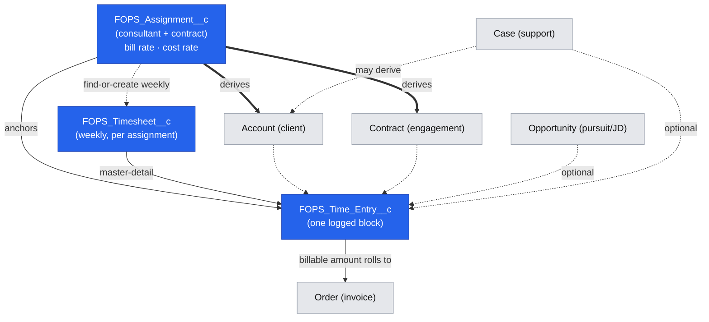

# Time-Log Entry — Feature Analysis & UX Design Proposal

**Product:** FreelanceHub (React UI Bundle on Salesforce, backed by the FreelanceOps data model)
**Author:** Business Analyst
**Date:** 2026-08-10
**Status:** Proposal for owner review — analysis & design only (no application code)

---

## 1. Summary

Today's Time Tracking page is a single "Log time" dialog (project + date + hours + description + billable) writing to a flat `TimeEntry`. This proposal turns it into a **fast, keyboard-first, multi-mode time-logging experience** — a running timer, quick manual entry with duration parsing, a start/end range, a weekly grid, and one-tap presets — that captures the richer FreelanceOps reality: every block links to an **Assignment → Timesheet** roll-up and can optionally reference a **Case, Account, Contract or Opportunity**, with bill/cost rates, overtime multipliers and billable amounts computed automatically. The design borrows proven patterns from Harvest, Toggl Track, Clockify, Everhour and Tempo, and is built entirely from the shadcn/ui primitives already in the repo (`Tabs`, `Dialog`, `Select`, `Popover`, `Command`, `Badge`, `Calendar`). The guiding principle: **logging a block should take one or two keystrokes; getting the links and money right should happen automatically from the active Assignment.**

---

## 2. Research findings

Concrete, proven patterns extracted from leading tools, with an explicit "what we should borrow" call for each.

| Tool | Notable patterns | What we should borrow |
|---|---|---|
| **Harvest** | Two explicit timer modes — **Duration** vs **Start/End times** — chosen per user. Accepts decimal (`1.5`) or `HH:MM` (`1:30`) input. Account-wide **rounding**: nearest / up to nearest **6, 15 or 30 min**, applied per-entry *before* totalling. Day view + Week view. | Dual timer modes; decimal + `HH:MM` parsing; configurable rounding (nearest/up, 6/15/30) applied per entry; day + week views. |
| **Toggl Track** | **Idle detection** with "Discard idle" / "Discard & continue" prompts. Calendar **snapping** (start/end snapping + duration snapping). Billable is independent of project (billable entry on non-billable project and vice-versa). Rate changes can be non-retroactive on paid plans. | Idle prompt on the running timer; billable flag that defaults from Assignment but is independently overridable; snapshot the rate onto the entry so later rate changes don't rewrite history. |
| **Clockify** | Keyboard-first: **`N`** starts timer, **`M`** toggles manual mode. Timer **works offline** and can be stopped from any device. Bulk timesheet entry in a grid. Multiple duration display formats (full / compact / decimal). | Global hotkeys (start/stop, manual mode); offline-tolerant timer that survives reload; grid bulk entry; user-selectable duration display. |
| **Everhour** | Billing methods: **project rate / member rate / fixed fee**. Overtime **multipliers** (time-and-a-half, double-time). Approval states: submit → approve / reject / **partial approve** / **lock**. | Rate resolution order (assignment → contract → default); overtime multiplier field driving amount math; submit/approve/lock lifecycle on the Timesheet. |
| **Salesforce Field Service** (`TimeSheet` / `TimeSheetEntry`) | Native **weekly `TimeSheet`** header with child **`TimeSheetEntry`** rows; **approval process** on submit; mobile time-sheet logging. This is the native analogue of our `FOPS_Timesheet__c` → `FOPS_Time_Entry__c`. | Mirror the header/line + approval shape we already have; a weekly Timesheet is the unit of submission and approval, not the individual entry. |
| **Jira / Tempo** | Worklog attached to an **issue** (our analogue: `Case`). **Suggested activities** ("approve this suggestion") from calendar/tool signals. Timesheet **periods** with lead review → approve/reject. | Case-linked worklogs; a "suggestions" surface later (from calendar / recent work); period-based approval. |
| **Freelance-focused (general)** | Emphasis on speed (presets, recent-entry re-log), unbilled-value visibility, invoice roll-up. | One-tap presets (`+15m`, `+30m`, `+1h`, `lunch`), "duplicate/repeat last entry", and prominent **unbilled value** (already a KPI on our page). |

**Sources:** [Harvest — timer modes](https://www.getharvest.com/blog/timer-mode), [Harvest — rounding](https://support.getharvest.com/hc/en-us/articles/360053116772-How-does-time-rounding-work), [Harvest — timesheet settings](https://support.getharvest.com/hc/en-us/articles/360048181812-Timesheet-settings), [Toggl — idle detection](https://clockk.com/alt/does-toggl-track-report-idle-time), [Toggl — billable rates](https://support.toggl.com/en/articles/2216967-billable-rates), [Clockify — timer](https://clockify.me/features/timer), [Clockify — create a time entry](https://clockify.me/help/time-tracking/creating-a-time-entry), [Everhour — billable/non-billable](https://support.everhour.com/article/483-tracking-billable-non-billable-time), [Everhour — overtime template](https://everhour.com/calculators/overtime-log-template), [Salesforce — set up time sheets](https://help.salesforce.com/s/articleView?language=en_US&id=service.fs_set_up_timesheets.htm&type=5), [Salesforce — TimeSheet object](https://developer.salesforce.com/docs/atlas.en-us.field_service_dev.meta/field_service_dev/sforce_api_objects_timesheet.htm), [Tempo — logging time](https://help.tempo.io/timesheets/latest/logging-time-in-jira-issues-using-tempo-timesheets), [Tempo — approvals](https://help.tempo.io/timesheets/latest/timesheet-approvals).

---

## 3. Logging modes

Six modes behind one **mode switcher** (`Tabs`). All modes ultimately write the same `FOPS_Time_Entry__c`; they differ only in *how the duration and timestamps are captured*. `FOPS_Hours__c` (decimal) is always the stored canonical value.

### 3a. Manual hours/minutes  — **MVP**
- **Description:** Type a duration into a single smart field. Parses decimal (`1.5`), `HH:MM` (`1:30`), and shorthand (see 3f). Plus a date field (defaults to today).
- **Best for:** Retrospective logging — "I did 2h on X yesterday." The 80% case for consultants reconstructing a day.
- **Data captured:** `FOPS_Hours__c`, `FOPS_Work_Date__c`. No start/end timestamps.
- **UX notes:** Autofocus the duration field; `Enter` saves and reopens for the next block ("save & add another"). Live-preview the parsed value ("= 1.50 h") beneath the input. This replaces today's `type=number` hours box.
- **Priority:** **MVP.**

### 3b. Live timer / stopwatch (start-stop, pause/resume)  — **MVP (basic) / v2 (idle)**
- **Description:** A persistent timer widget. Start → runs (mm:ss), Pause/Resume, Stop → creates the entry with real `Start`/`End` timestamps and computed hours. Only **one** timer runs at a time; starting a new one prompts to stop the current.
- **Best for:** Live work at the desk — support calls (Case), focused delivery blocks.
- **Data captured:** `FOPS_Time_Entry_Start__c`, `FOPS_Time_Entry_End__c` (NEW), derived `FOPS_Hours__c`, plus accumulated paused time excluded.
- **UX notes:** Timer state persists across reloads/navigation (localStorage + wall-clock elapsed, Clockify-style) so a refresh never loses time. Widget lives in the page header and stays visible. **Idle detection (v2):** if no input for N minutes, on return prompt "Discard idle / Keep / Discard & continue" (Toggl pattern). Description and links can be filled *while* running or at stop.
- **Priority:** **MVP** for start/pause/resume/stop persistence; **v2** for idle detection.

### 3c. Start-time + end-time range  — **v2**
- **Description:** Two time inputs ("09:00" → "10:30") on a chosen date; hours computed from the span. Overnight spans handled (end < start ⇒ +1 day, with confirm).
- **Best for:** Reconstructing a specific meeting/appointment where the clock times are known and matter (billing transparency, disputes).
- **Data captured:** `FOPS_Time_Entry_Start__c`, `FOPS_Time_Entry_End__c`, derived `FOPS_Hours__c`.
- **UX notes:** Same start/end fields the timer produces, just hand-entered — feeds overlap detection (§5). Snapping to the rounding increment on blur.
- **Priority:** **v2.**

### 3d. Weekly grid / calendar quick-entry  — **v2**
- **Description:** A Timesheet-style grid: rows = Assignment/Project (optionally + Category), columns = Mon–Sun, cells = hours. Per-row and per-day totals; a bottom total row. Type in a cell, `Tab`/arrow to the next.
- **Best for:** End-of-week catch-up and salaried/retainer consultants who log the same few projects daily. Mirrors Harvest Week view & Salesforce weekly TimeSheet.
- **Data captured:** One `FOPS_Time_Entry__c` per non-empty cell, all sharing the row's Assignment and the column's `FOPS_Work_Date__c`, rolled to one `FOPS_Timesheet__c`.
- **UX notes:** Cells accept the same duration parser (3f). Highlight the current day column. "Copy last week" to prefill. Show the week's billable/non-billable split and hours-vs-target. Editing a cell that maps to multiple entries opens a day drill-down rather than clobbering.
- **Priority:** **v2** (highest-value v2 item for retainer users).

### 3e. Quick presets (`+15m`, `+30m`, `+1h`, `lunch`)  — **MVP**
- **Description:** A row of one-tap chips. `+15m`/`+30m`/`+1h` **increment** the current duration; `lunch` inserts a non-billable break block (0:30 or 1:00, category = Break). A "repeat last entry" chip re-logs the previous block's links + description.
- **Best for:** Speed — nudging a value, logging habitual breaks, re-logging recurring work.
- **Data captured:** Same as manual; presets are just fast setters. `lunch` sets `FOPS_Is_Billable__c = false` and a Break category.
- **UX notes:** Render as `Badge`/`Button` chips under the duration field. Increment chips stack (`+15m` twice = 30m). Keep it to 4–5 chips; make them workspace-configurable later.
- **Priority:** **MVP** (cheap, high-delight).

### 3f. Duration parsing (`1h30`, `1.5`, `90m`)  — **MVP**
- **Description:** Not a UI mode but the **shared input grammar** every duration field uses. Accepts: decimal (`1.5`, `.25`), `HH:MM` (`1:30`), unit shorthand (`1h30`, `1h`, `90m`, `45min`, `2h15m`), and bare integers (interpreted as hours or minutes per a workspace setting; default: `> 15` ⇒ minutes heuristic is *disabled* by default to avoid surprises — bare number = hours).
- **Best for:** Everyone — removes friction and mental math.
- **Data captured:** Normalizes to decimal `FOPS_Hours__c`; live "= 1.50 h" preview; invalid input shows inline error and blocks save.
- **UX notes:** One pure parser function reused by manual field, grid cells, and range fallback. Round on blur to the rounding increment (§5).
- **Priority:** **MVP** (foundational; unlocks 3a, 3d, 3e).

**Mode-selection summary**

| Mode | Captures timestamps? | Primary user | Priority |
|---|---|---|---|
| Manual hours (3a) | No | Everyone, retrospective | MVP |
| Live timer (3b) | Yes | Live desk work / support | MVP (idle → v2) |
| Start–end range (3c) | Yes | Known meeting times | v2 |
| Weekly grid (3d) | No (day-level) | Retainer / weekly catch-up | v2 |
| Presets (3e) | No | Speed / breaks / repeat | MVP |
| Duration parsing (3f) | n/a (grammar) | Everyone | MVP |

---

## 4. Linking model

An entry lives inside an **Assignment → Timesheet** roll-up and *references* business context (Account, Contract/Opportunity, Case). The Assignment is the **anchor** that supplies almost everything else by default.

### Primary vs optional

| Link | Field | Required? | Role |
|---|---|---|---|
| **Assignment** | `FOPS_Assignment__c` | **Required (primary)** | The anchor. Carries bill rate + cost rate; identifies the consultant + contract. Everything defaults from here. |
| **Timesheet** | `FOPS_Timesheet__c` | **Required — derived** | The weekly bucket the entry rolls up to. Resolved automatically from (Assignment + week-of Work Date); auto-created if the week's timesheet doesn't exist. User never picks it manually. |
| **Account** | `Account` (FOPS field) | Optional — auto-filled | The client company. Defaults from the Assignment's Contract's Account; read-only unless overridden. |
| **Contract** | `Contract` (FOPS field) | Optional — auto-filled | The engagement. Defaults from the Assignment. |
| **Opportunity** | `Opportunity` (FOPS field) | Optional | Pursuit/JD work (e.g. pre-sales, proposal effort) that isn't under a signed Contract. Mutually contextual with Contract — usually one or the other. |
| **Case** | `FOPS_Case__c` | Optional | Support work. When set, prefer defaulting Account/Contract *from the Case* if they disagree with the Assignment (flag the mismatch). |

### Cascade & smart defaults (the core UX win)

Picking an **Assignment** auto-fills, in this order:

1. **Account** ← Assignment.Contract.Account
2. **Contract** ← Assignment.Contract
3. **Bill rate** ← Assignment bill rate → else Contract default → else workspace default (snapshotted onto the entry, see §5)
4. **Cost rate** ← Assignment cost rate
5. **Billable default** ← Assignment/Contract's default billable flag → `FOPS_Is_Billable__c`
6. **Timesheet** ← find-or-create weekly `FOPS_Timesheet__c` for (Assignment, week containing Work Date)

Overrides: Account/Contract are shown but locked by default with an "override" affordance; changing them flags the entry as *manually linked* (visual badge) so approvers can spot deviations. Selecting a **Case** narrows/derives Account+Contract from the Case and warns on conflict with the Assignment.

### Keeping data clean
- **Single source of truth:** the Assignment. Don't ask users to re-pick Account/Contract; derive and lock.
- **Snapshot rates** onto the entry at save (don't live-join), so historical value is stable when rates change later (Toggl pattern).
- **Validation:** Work Date must fall within the resolved Timesheet's week and within the Assignment's active date range; block or warn otherwise.
- **Mismatch flags:** Case↔Assignment Account/Contract conflicts surface a non-blocking warning badge for the approver.

### Diagram



**ASCII fallback**

```
              [Assignment]  (REQUIRED anchor: bill rate, cost rate, consultant, contract)
                  |  derives
        +---------+----------+-----------+
        v         v          v           v
    [Account] [Contract]  [bill/cost   [find-or-create
     (locked)  (locked)    rate snap]   weekly Timesheet] --master/detail--+
                                                                            v
   optional:  [Opportunity]  [Case] .......................... >  [ TIME ENTRY ]
                                                                            |
                                                          billable amount rolls to
                                                                            v
                                                                        [Order/Invoice]
```

---

## 5. Fields & rules

### Field list (mapped to `FOPS_Time_Entry__c`)

| UI field | FOPS field | Type | Notes |
|---|---|---|---|
| Work date | `FOPS_Work_Date__c` | Date | Defaults today; must sit in the Timesheet week. |
| Hours | `FOPS_Hours__c` | Decimal | Canonical stored duration (post-parse, post-round). |
| Billable | `FOPS_Is_Billable__c` | Checkbox | Defaults from Assignment; independently overridable. |
| Overtime | `FOPS_Overtime__c` | Checkbox | Marks the block as OT; may auto-set the multiplier. |
| Rate multiplier | `FOPS_Rate_Multiplier__c` | Decimal | 1.0 default; 1.5 / 2.0 for OT (Everhour pattern). |
| Work category | `FOPS_Work_Category__c` | Picklist | Delivery / Meeting / Support / Admin / Travel / Break, etc. `lunch` preset ⇒ Break. |
| Description | `FOPS_Description__c` | Text | Client-visible narrative. |
| Reference | `FOPS_Reference__c` | Text | PO/ticket/external ref. |
| Internal note | `FOPS_Internal_Note__c` | Text | Never shown on invoice. |
| Case | `FOPS_Case__c` | Lookup(Case) | Optional support link. |
| Assignment | `FOPS_Assignment__c` | Lookup | **Required** anchor. |
| Timesheet | `FOPS_Timesheet__c` | Master-Detail | Derived weekly roll-up. |
| Account / Contract / Opportunity | FOPS std-object fields | Lookup | Derived/optional per §4. |

### NEW fields to add

| Field (proposed API name) | Type | Why |
|---|---|---|
| `FOPS_Time_Entry_Start__c` | DateTime | Timer & range modes need real start timestamp; enables overlap detection. |
| `FOPS_Time_Entry_End__c` | DateTime | Ditto; hours derived from End−Start minus paused time. |
| `FOPS_Bill_Rate_Snapshot__c` | Currency | Rate captured at save so history is stable (Toggl non-retroactive pattern). |
| `FOPS_Cost_Rate_Snapshot__c` | Currency | Cost/margin reporting stable over time. |
| `FOPS_Billable_Amount__c` | Currency (formula or stored) | `= Hours × Bill Rate × Multiplier` (see rule). Prefer stored (snapshot-based), not live formula. |
| `FOPS_Entry_Source__c` | Picklist | manual / timer / range / grid / preset — analytics + audit. |
| `FOPS_Rounded__c` | Checkbox | Whether rounding altered the raw captured value (transparency for approvers). |

### Rules

1. **Duration parsing → normalize** (§3f) to decimal hours before anything else.
2. **Rounding** (Harvest pattern): workspace setting — mode `nearest | up` × increment `6 | 15 | 30` min. Applied **per entry, before totalling**. Round on field blur / on save; set `FOPS_Rounded__c` if the value changed. Grid cells and range spans round on the same rule.
3. **Overtime / multiplier:** `FOPS_Overtime__c` may auto-suggest `FOPS_Rate_Multiplier__c` (1.5 default OT); multiplier remains editable. Non-OT default 1.0.
4. **Billable amount:** `FOPS_Billable_Amount__c = FOPS_Hours__c × FOPS_Bill_Rate_Snapshot__c × FOPS_Rate_Multiplier__c`, **only when `FOPS_Is_Billable__c = true`** (else 0). Cost side mirrors with cost-rate snapshot for margin.
5. **Validation:** hours `> 0` and `≤ 24`; Work Date within Assignment active range and within its Timesheet week; Assignment required; Description required when billable (configurable) so invoices aren't blank.
6. **Duplicate / overlap detection:**
   - *Duplicate:* same Assignment + Work Date + Hours + Category + Description within a short window ⇒ warn "Looks like a duplicate."
   - *Overlap:* for entries with Start/End on the same day, detect intersecting `[Start,End)` spans ⇒ non-blocking warning "Overlaps 09:00–10:30 block." Timer prevents two concurrently running timers by construction.
7. **Timesheet lifecycle:** entries editable while Timesheet is `Draft`/`Open`; **locked** once the Timesheet is Submitted/Approved (Everhour/Tempo/Field-Service pattern). Approval acts on the weekly Timesheet, not individual entries.

---

## 6. UI/UX design

Built entirely from existing shadcn/ui primitives in `src/components/ui/` (`tabs`, `dialog`, `select`, `popover`, `command`*, `badge`, `calendar`, `datePicker`, `input`, `button`). *`Command` isn't in the repo yet — add it (`npx shadcn add command`) for the searchable combobox pickers.

### 6.1 The Log-Time surface

A larger `Dialog` (or a slide-over on desktop) whose top is a **mode switcher** (`Tabs`): **Manual · Timer · Range · Week**. Presets and the duration grammar are shared across Manual/Range/Week. The linking picker block is identical in every mode, so users learn it once.

```
┌─ Log time ─────────────────────────────────────────────── ✕ ┐
│  [ Manual ] [ Timer ] [ Range ] [ Week ]        ⌘K search    │  <- Tabs
│                                                              │
│  Assignment  [ Acme · "Platform Rebuild" · S. Rivera   ▾ ]   │  <- Command combobox (search)
│    ↳ Account: Acme Corp   Contract: MSA-2231   (locked ⤺)    │  <- derived, Badge "auto"
│                                                              │
│  Duration    [ 1h30            ] = 1.50 h   ● billable       │  <- parsed preview + toggle
│  [ +15m ][ +30m ][ +1h ][ lunch ][ ⟳ repeat last ]          │  <- preset chips
│                                                              │
│  Date        [ 2026-08-10  📅 ]     Category [ Delivery ▾ ]  │
│  Description [ What did you work on? ....................... ]│
│  ▸ More: Reference · Internal note · Case · OT×mult          │  <- Collapsible advanced
│                                                              │
│                              [ Cancel ]  [ Save & add ↵ ]    │
└──────────────────────────────────────────────────────────────┘
```

- **Save & add** (`Enter`) commits and keeps the dialog open with links retained — rapid multi-block logging. `Esc` closes.
- Derived Account/Contract render as muted, read-only lines with an "auto" `Badge`; the ⤺ icon unlocks override (which swaps the badge to "manual").

### 6.2 Timer widget (persistent, in the page header)

```
Idle:     [ ▶ Start timer ]  ⌘/N
Running:  ● 00:42:17  Acme · Platform Rebuild   [ ⏸ ] [ ⏹ Stop ]
Paused:   ⏸ 00:42:17 (paused)                   [ ▶ ] [ ⏹ Stop ]
```

- Lives in the header so it's visible on every page; state in localStorage + wall-clock so reloads/navigation don't lose time (Clockify). Starting a second timer prompts to stop the first.
- On **Stop**, opens the Log-Time dialog pre-filled with Start/End + computed hours for confirmation/links.
- **v2 idle:** returning after inactivity shows a `Popover` — "You were idle 12 min. [Discard] [Keep] [Discard & continue]."

### 6.3 Linking picker (cascading, searchable)

- **Assignment** picker = `Command` combobox: type-ahead over "Client · Project · Consultant", grouped by active Contract; recently-used pinned to top; keyboard-navigable.
- Selecting an Assignment fires the §4 cascade and animates the derived Account/Contract lines in.
- **Case** picker (advanced) = second `Command` combobox scoped to the resolved Account; picking one reconciles Account/Contract with a warning `Badge` on conflict.

### 6.4 Weekly grid (Week tab)

```
Week of Aug 4–10                      ◀  This week  ▶     [ Copy last week ]
┌──────────────────────────┬────┬────┬────┬────┬────┬────┬────┬───────┐
│ Assignment / Category    │ Mo │ Tu │ We │ Th │ Fr │ Sa │ Su │ Total │
├──────────────────────────┼────┼────┼────┼────┼────┼────┼────┼───────┤
│ Acme · Platform Rebuild  │ 8  │ 6  │ 7.5│ 8  │ 4  │    │    │ 33.5  │
│ Globex · Support ·(Case) │ 1  │ 2  │    │ 1.5│    │    │    │  4.5  │
│ + Add row (assignment ▾) │    │    │    │    │    │    │    │       │
├──────────────────────────┼────┼────┼────┼────┼────┼────┼────┼───────┤
│ Day total                │ 9  │ 8  │ 7.5│ 9.5│ 4  │ 0  │ 0  │ 38.0  │
└──────────────────────────┴────┴────┴────┴────┴────┴────┴────┴───────┘
Billable 34.0 · Non-billable 4.0        Target 40 ▓▓▓▓▓▓▓▓░░  [ Submit week ]
```

- Cells use the shared duration parser; `Tab`/arrows move; today's column highlighted; empty cell = no entry (not a zero). "Submit week" transitions the Timesheet into approval and locks cells.

### 6.5 States

- **Empty:** keep the current friendly empty card ("No time logged yet") but add a primary **▶ Start timer** alongside **Log time**, and a hint about presets.
- **Loading:** `Skeleton` rows in the table and shimmer cells in the grid; the timer widget shows a spinner only on its own async, never blocking the header.
- **Keyboard-first:** `N`/`⌘` start-stop timer, `M` manual dialog (Clockify), `Enter` save-and-add, `Esc` cancel, `⌘K` open the search combobox, arrow/`Tab` grid navigation. Document these in a `?` shortcut `Popover`.
- **Mobile:** dialog becomes a full-height sheet; big touch presets; timer Start/Stop as a thumb-reachable FAB; grid collapses to a per-day list. Timer tolerant of backgrounding (wall-clock based).
- **Offline-ish:** timer never depends on the network; keep it running and reconcile the entry on reconnect.

### 6.6 Micro-interactions

- Live "= 1.50 h" preview animates as you type; invalid input shakes and shows inline error.
- Derived Account/Contract lines **fade/slide in** on Assignment select.
- Running timer's dot **pulses**; elapsed digits use `tabular-nums` (already the table convention).
- Preset chips give a quick scale-tap; saved entry toast via existing `sonner`.
- Billable/OT toggles animate the amount preview (`= $X`) so the money impact is instantly visible.

---

## 7. Prioritized roadmap

**MVP** — fast single-entry logging with correct links & money
- [ ] Duration parser (`1.5`, `1:30`, `1h30`, `90m`) with live preview + inline validation
- [ ] Manual hours mode (replaces today's number box) with **Save & add** (`Enter`)
- [ ] Preset chips (`+15m`, `+30m`, `+1h`, `lunch`, repeat-last)
- [ ] Basic live timer (start / pause / resume / stop, persisted across reload, single-timer rule)
- [ ] Assignment `Command` combobox + §4 cascade (auto Account/Contract, rate snapshot, billable default, find-or-create weekly Timesheet)
- [ ] Rounding setting (nearest/up × 6/15/30) applied per entry
- [ ] Billable amount = hours × bill-rate snapshot × multiplier; OT checkbox + multiplier
- [ ] Rate/cost snapshot fields + `FOPS_Entry_Source__c`; NEW Start/End fields
- [ ] Advanced (collapsible): Reference, Internal note, Case link, Category

**v2** — coverage & throughput
- [ ] Weekly grid entry + "copy last week" + Submit-week
- [ ] Start–end range mode with overnight handling
- [ ] Timer idle detection (discard / keep / discard & continue)
- [ ] Duplicate & overlap warnings
- [ ] Timesheet submit → approve/reject/lock lifecycle; entries lock on submit
- [ ] Keyboard shortcut layer (`N`/`M`/`⌘K`) + shortcut help
- [ ] Mobile sheet + timer FAB refinements

**Later** — intelligence & scale
- [ ] "Suggested entries" from calendar / recent-work signals (Tempo)
- [ ] Bulk edit / reassign across selected entries
- [ ] Non-retroactive rate changes UI; multi-currency per Contract
- [ ] Configurable presets & categories per workspace
- [ ] Partial approval; multi-level approval; approver mismatch queue

---

## 8. Open questions (owner decisions)

1. **Rounding:** workspace-wide only (Harvest) or per-Contract? Default increment — 15 min? Nearest or up?
2. **Bare-number parsing:** does a lone `2` mean 2 hours or 2 minutes? (Recommend: hours, always.)
3. **Description required when billable?** Protects invoices but adds friction — enforce, warn, or off?
4. **Case ⇄ Assignment conflict:** when a Case's Account/Contract disagree with the Assignment, which wins — and is it a block or a warning?
5. **Opportunity vs Contract:** can one entry link both, or strictly one engagement context?
6. **Approval granularity:** approve at the weekly Timesheet level only, or allow per-entry rejection? Multi-level approval needed?
7. **Rate source of truth & retroactivity:** confirm resolution order (Assignment → Contract → workspace) and that snapshots must stay fixed when rates later change.
8. **Timer scope:** one global running timer per user (recommended), or allow concurrent timers?
9. **Overtime automation:** should OT auto-flag past a daily/weekly hours threshold, or stay manual?
10. **Currency:** single workspace currency (today's model) or per-Contract currency now?
```
