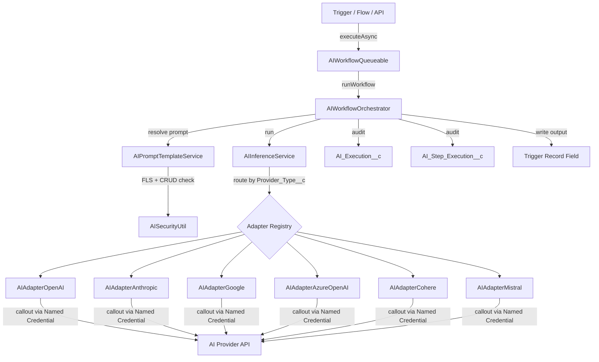
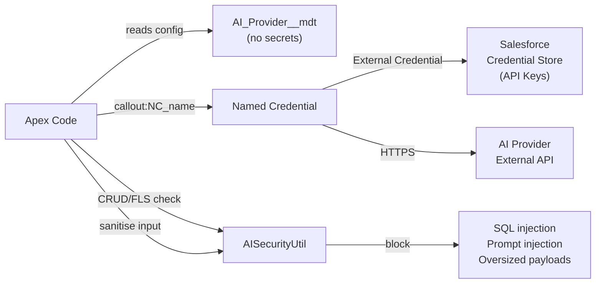
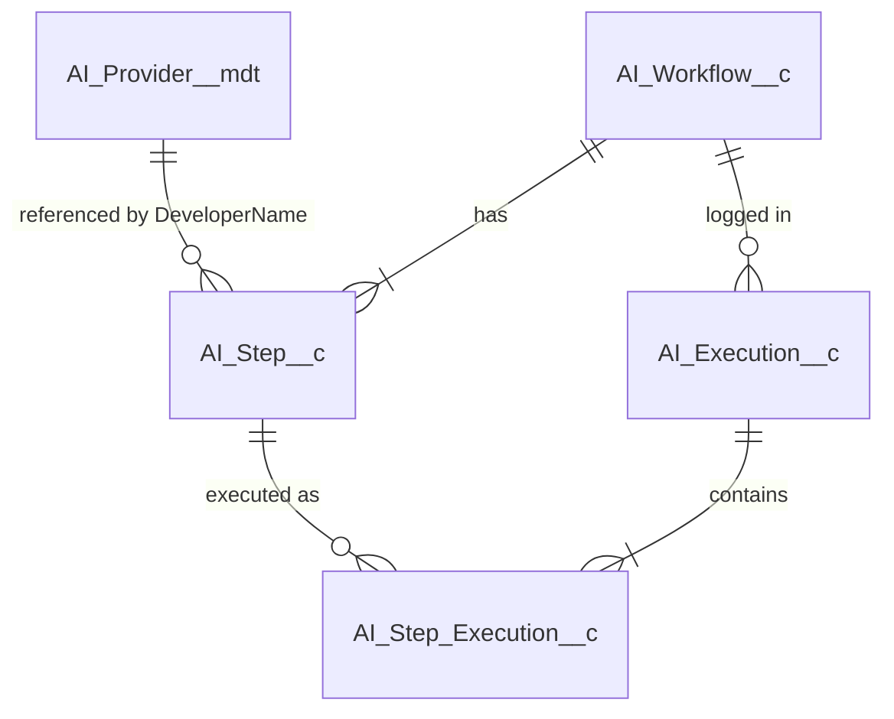

# AI Orchestration — Architecture



## Security Architecture



## Data Model



## Key Security Controls

| Control | Implementation |
|---------|---------------|
| API key storage | Salesforce External Credentials (never CMDT/fields/Apex) |
| HTTP callouts | Named Credentials only — never `Http.send()` with raw URLs |
| CRUD enforcement | `AISecurityUtil.assertReadable/Creatable/Updatable/Deletable()` |
| FLS enforcement | `AISecurityUtil.assertFieldsReadable/Writable()` |
| SOQL injection | Typed `Id` bind variables; no string concatenation in queries |
| Prompt injection | Field values sanitised before interpolation; `{{ }}` escaped |
| Input size limits | 32,000 char max prompt; 50 variable max per template |
| Field name validation | Regex allowlist: `[a-zA-Z][a-zA-Z0-9_]*(__c\|__r)?` |
| Audit trail | Immutable `AI_Execution__c` + `AI_Step_Execution__c` records |
| Sharing | `with sharing` throughout; `without sharing` only in `SystemWriter` for audit inserts |
| Permission Sets | `AI_Orchestration_Admin` / `AI_Orchestration_User` — no Profile-only access |
| Encrypted fields | Shield encryption recommended on `Prompt_Sent__c`, `Raw_Response__c` |

## Supported AI Providers

| Provider | Adapter Class | Models (examples) |
|----------|--------------|-------------------|
| OpenAI | `AIAdapterOpenAI` | gpt-4o, gpt-4o-mini, gpt-4-turbo, o1, o3 |
| Anthropic | `AIAdapterAnthropic` | claude-3-5-sonnet, claude-3-opus, claude-3-haiku |
| Google Gemini | `AIAdapterGoogle` | gemini-1.5-pro, gemini-1.5-flash, gemini-2.0-flash |
| Azure OpenAI | `AIAdapterAzureOpenAI` | Any Azure-deployed model |
| Cohere | `AIAdapterCohere` | command-r-plus, command-r, command-light |
| Mistral | `AIAdapterMistral` | mistral-large-latest, mistral-small-latest, codestral |

## Adding a New Provider

1. Create a Named Credential `AI_<Provider>` in Salesforce Setup
2. Create `AIAdapter<Provider>.cls` implementing `AIProviderAdapter`
3. Add CMDT record `AI_Provider__mdt` with `Provider_Type__c = 'MYPROVIDER'`
4. Register in `AIInferenceService.buildRegistry()`:
   ```apex
   registry.put('MYPROVIDER', new AIAdapterMyProvider());
   ```
5. Add `@IsTest` coverage in `AIInferenceServiceTest`
